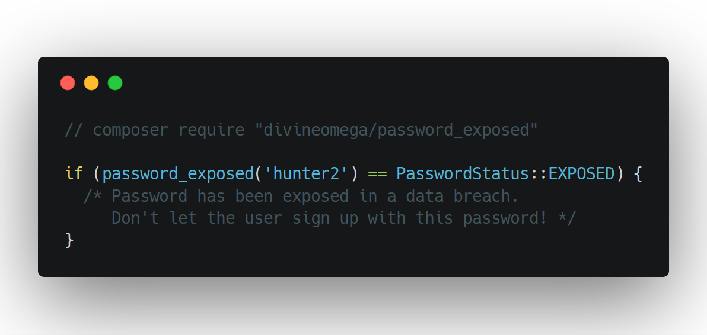

# 🔒 Password Exposed Helper Function

This PHP package provides a `password_exposed` helper function, that uses the haveibeenpwned.com API to check if a password has been exposed in a data breach.

<p align="center">
    
</p>

<p align="center">
    <a href="https://travis-ci.org/DivineOmega/password_exposed">
        
    </a>
    <a href="https://styleci.io/repos/119845896">
        
    </a>
    <a href="https://packagist.org/packages/divineomega/password_exposed/stats">
        
    </a>
</p>

## Installation

The `password_exposed` package can be easily installed using Composer. Just run the following command from the root of your project.

```
composer require "divineomega/password_exposed"
```

If you have never used the Composer dependency manager before, head to the [Composer website](https://getcomposer.org/) for more information on how to get started.

## Usage

To check if a password has been exposed in a data breach, just pass it to the `password_exposed` method.

Here is a basic usage example:

```php
switch(password_exposed('hunter2')) {

    case PasswordStatus::EXPOSED:
        // Password has been exposed in a data breach.
        break;

    case PasswordStatus::NOT_EXPOSED:
        // Password has not been exposed in a known data breach.
        break;

    case PasswordStatus::UNKNOWN:
        // Unable to check password due to an API error.
        break;
}
```

If you prefer to avoid using helper functions, the following syntax is also available.

```php
$passwordStatus = (new PasswordExposedChecker())->passwordExposed($password);
```

### SHA1 Hash
You can also supply the SHA1 hash instead of the plain text password, by using the following method.

```php
$passwordStatus = (new PasswordExposedChecker())->passwordExposedByHash($hash);
```

or...

```php
$passwordStatus = password_exposed_by_hash($hash);
```
